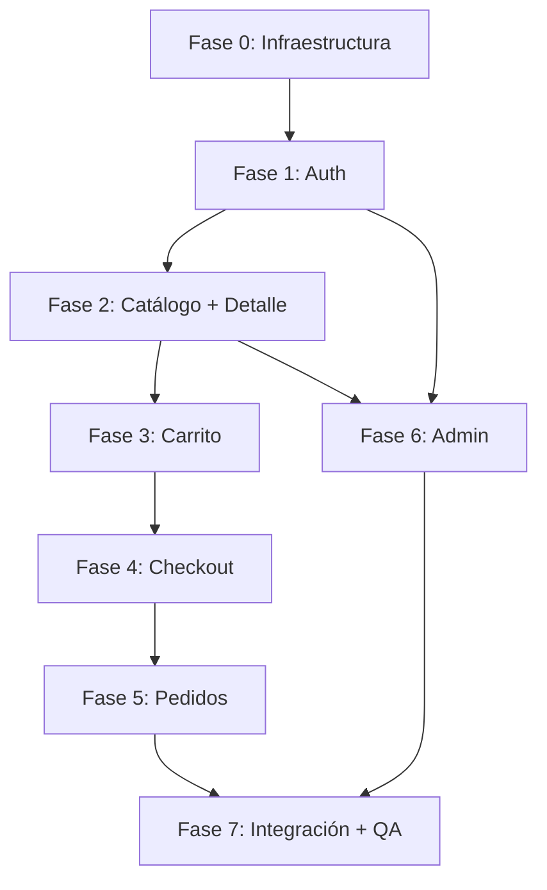

# Planificación de Implementación y Desarrollo — ECommerce Demo

> **Última actualización**: 2026-04-08
> **Estado general**: 📋 Planificado — Pendiente de ejecución

---

## Resumen del Proyecto

Aplicación móvil de ecommerce desarrollada con **Expo (React Native)** como frontend y **Express + MySQL (XAMPP)** como backend REST local. El sistema implementa un flujo completo de compra de productos físicos organizados en 4 categorías, con gestión de stock en tiempo real, autenticación JWT y panel de administración.

---

## Orden de Desarrollo por Fases

El desarrollo sigue un orden basado en **dependencias funcionales**: las capas base se construyen primero para que los módulos superiores puedan consumirlas.

```
FASE 0 ─── Infraestructura Base
FASE 1 ─── MOD-01: Autenticación
FASE 2 ─── MOD-02: Catálogo de Productos + MOD-03: Detalle de Producto
FASE 3 ─── MOD-04: Carrito de Compras
FASE 4 ─── MOD-05: Checkout y Confirmación
FASE 5 ─── MOD-06: Historial de Pedidos
FASE 6 ─── MOD-07: Panel de Administración
FASE 7 ─── Integración Final + QA
```

---

## FASE 0 — Infraestructura Base

### Objetivo
Configurar la estructura de carpetas, dependencias, conexión a BD y configuración base de ambos proyectos.

### Backend

| Tarea | Archivo(s) | Descripción |
|-------|------------|-------------|
| F0-B01 | `backend/package.json` | Inicializar proyecto Node.js con dependencias: express, mysql2, jsonwebtoken, bcryptjs, multer, cors, dotenv, express-validator, nodemon (dev) |
| F0-B02 | `backend/.env` | Configurar variables: PORT, DB_HOST, DB_PORT, DB_USER, DB_PASSWORD, DB_NAME, JWT_SECRET, JWT_EXPIRES_IN |
| F0-B03 | `backend/src/config/db.js` | Pool de conexiones mysql2/promise con la configuración de XAMPP |
| F0-B04 | `backend/src/app.js` | Setup Express: cors, json parser, rutas base, static uploads |
| F0-B05 | `backend/server.js` | Entry point: importar app, listen en PORT |
| F0-B06 | `backend/src/middleware/verifyJWT.js` | Middleware de verificación de token Bearer JWT |
| F0-B07 | `backend/src/middleware/isAdmin.js` | Middleware de verificación de rol admin |

### Mobile

| Tarea | Archivo(s) | Descripción |
|-------|------------|-------------|
| F0-M01 | `mobile/` | Inicializar proyecto Expo con `npx create-expo-app` |
| F0-M02 | `mobile/package.json` | Instalar: expo-router, nativewind, moti, react-native-reanimated, axios, zustand, expo-secure-store, expo-image-picker, expo-font, react-native-safe-area-context |
| F0-M03 | `mobile/constants/colors.ts` | Paleta de colores según doc `05_diseno_estructura_paginas.md` |
| F0-M04 | `mobile/constants/api.ts` | API_BASE_URL configurable por entorno |
| F0-M05 | `mobile/constants/categories.ts` | Array de categorías fijas |
| F0-M06 | `mobile/services/api.ts` | Instancia Axios con interceptor Bearer JWT |
| F0-M07 | `mobile/tailwind.config.js` | Configuración NativeWind con paleta custom |
| F0-M08 | `mobile/babel.config.js` | Preset Expo + plugin NativeWind + Reanimated |
| F0-M09 | `mobile/app/_layout.tsx` | Root layout: SafeAreaProvider, Zustand, SplashScreen, fonts |

### Base de Datos

| Tarea | Archivo(s) | Descripción |
|-------|------------|-------------|
| F0-D01 | `docs/07_schema.sql` | Importar schema en XAMPP → phpMyAdmin (ya documentado) |

### Pruebas Unitarias — Fase 0

| Test ID | Archivo de Test | Qué Valida |
|---------|----------------|-------------|
| T0-01 | `backend/__tests__/config/db.test.js` | Pool se crea correctamente, retorna conexión válida |
| T0-02 | `backend/__tests__/middleware/verifyJWT.test.js` | Acepta token válido, rechaza inválido/expirado/ausente |
| T0-03 | `backend/__tests__/middleware/isAdmin.test.js` | Permite admin, bloquea client, bloquea sin user |

---

## FASE 1 — MOD-01: Autenticación

### Objetivo
Implementar registro, login, cierre de sesión, guards de navegación y persistencia de sesión con JWT.

### Backend

| Tarea | Archivo(s) | Descripción |
|-------|------------|-------------|
| F1-B01 | `modules/auth/auth.routes.js` | Definir rutas POST `/api/auth/register` y POST `/api/auth/login` |
| F1-B02 | `modules/auth/auth.controller.js` | Controladores con validación express-validator |
| F1-B03 | `modules/auth/auth.service.js` | Lógica: bcryptjs hash, jwt.sign, buscar/crear usuario en BD |

### Mobile

| Tarea | Archivo(s) | Descripción |
|-------|------------|-------------|
| F1-M01 | `store/authStore.ts` | Zustand store: user, token, login(), logout(), hydrate() |
| F1-M02 | `services/authService.ts` | Llamadas API: login, register |
| F1-M03 | `hooks/useAuth.ts` | Hook: lee authStore, redirige si no hay sesión |
| F1-M04 | `app/(auth)/_layout.tsx` | Stack Navigator para auth (sin Tab Bar) |
| F1-M05 | `app/(auth)/login.tsx` | Pantalla de login según wireframe S-01 |
| F1-M06 | `app/(auth)/register.tsx` | Pantalla de registro según wireframe S-02 |
| F1-M07 | `app/(app)/_layout.tsx` | Tab Navigator + guard de sesión con `<Redirect>` |
| F1-M08 | `app/(admin)/_layout.tsx` | Stack Navigator + guard isAdmin con `<Redirect>` |

### Pruebas Unitarias — Fase 1

| Test ID | Archivo de Test | Qué Valida |
|---------|----------------|-------------|
| T1-01 | `backend/__tests__/modules/auth/auth.service.test.js` | Registro: crea usuario con hash, no duplica email |
| T1-02 | `backend/__tests__/modules/auth/auth.service.test.js` | Login: credenciales correctas retornan JWT, incorrectas retornan error |
| T1-03 | `backend/__tests__/modules/auth/auth.controller.test.js` | Validación: email inválido, password corta, campos faltantes |
| T1-04 | `mobile/__tests__/store/authStore.test.ts` | Login guarda token, logout limpia estado, hydrate lee SecureStore |

---

## FASE 2 — MOD-02: Catálogo + MOD-03: Detalle de Producto

### Objetivo
Implementar listado de productos con filtro por categoría, tarjetas de producto en grid, y pantalla de detalle con indicador de stock y selector de cantidad.

### Backend

| Tarea | Archivo(s) | Descripción |
|-------|------------|-------------|
| F2-B01 | `modules/categories/categories.routes.js` | GET `/api/categories` |
| F2-B02 | `modules/categories/categories.controller.js` | Controlador: listar categorías |
| F2-B03 | `modules/products/products.routes.js` | GET `/api/products`, GET `/api/products/:id` |
| F2-B04 | `modules/products/products.controller.js` | Controladores con filtro por categoría slug |
| F2-B05 | `modules/products/products.service.js` | Queries: listado (solo activos), detalle con stock |

### Mobile

| Tarea | Archivo(s) | Descripción |
|-------|------------|-------------|
| F2-M01 | `services/productService.ts` | Llamadas API: getProducts, getProductById, getCategories |
| F2-M02 | `components/ProductCard.tsx` | Tarjeta de producto (3 variantes: normal, stock bajo, sin stock) |
| F2-M03 | `components/ui/Badge.tsx` | Badges de categoría y estado |
| F2-M04 | `components/ui/StockAlert.tsx` | Alerta inline roja de stock |
| F2-M05 | `app/(app)/catalog/index.tsx` | Catálogo: FlatList grid 2 cols + tabs categoría S-03 |
| F2-M06 | `app/(app)/catalog/[id].tsx` | Detalle de producto con stock indicator S-04 |
| F2-M07 | `components/layout/ScreenWrapper.tsx` | SafeAreaView + ScrollView base |

### Pruebas Unitarias — Fase 2

| Test ID | Archivo de Test | Qué Valida |
|---------|----------------|-------------|
| T2-01 | `backend/__tests__/modules/products/products.service.test.js` | Listado retorna solo productos activos, filtra por categoría |
| T2-02 | `backend/__tests__/modules/products/products.service.test.js` | Detalle retorna producto con stock, retorna 404 si no existe |
| T2-03 | `backend/__tests__/modules/categories/categories.controller.test.js` | Retorna las 4 categorías del seed |
| T2-04 | `mobile/__tests__/components/ProductCard.test.tsx` | Renderiza 3 variantes correctamente según stock |
| T2-05 | `mobile/__tests__/components/StockAlert.test.tsx` | Muestra mensaje correcto, no renderiza si no hay error |

---

## FASE 3 — MOD-04: Carrito de Compras

### Objetivo
Implementar CRUD del carrito con validación de stock en backend, sincronización con Zustand y alertas inline.

### Backend

| Tarea | Archivo(s) | Descripción |
|-------|------------|-------------|
| F3-B01 | `modules/cart/cart.routes.js` | GET, POST, PATCH, DELETE `/api/cart` |
| F3-B02 | `modules/cart/cart.controller.js` | Controladores con validación del usuario autenticado |
| F3-B03 | `modules/cart/cart.service.js` | Lógica: agregar (validar stock), modificar (re-validar stock), eliminar |

### Mobile

| Tarea | Archivo(s) | Descripción |
|-------|------------|-------------|
| F3-M01 | `store/cartStore.ts` | Zustand: items[], addItem, updateQty, removeItem, clearCart, total |
| F3-M02 | `services/cartService.ts` | Llamadas API: getCart, addToCart, updateCartItem, removeCartItem |
| F3-M03 | `hooks/useCart.ts` | Helpers del cartStore |
| F3-M04 | `components/CartItem.tsx` | Componente ítem del carrito con controles cantidad S-05 |
| F3-M05 | `app/(app)/cart.tsx` | Pantalla carrito con estado vacío S-05 |

### Pruebas Unitarias — Fase 3

| Test ID | Archivo de Test | Qué Valida |
|---------|----------------|-------------|
| T3-01 | `backend/__tests__/modules/cart/cart.service.test.js` | Agregar: ok si hay stock, 409 si stock=0, 409 si qty>stock |
| T3-02 | `backend/__tests__/modules/cart/cart.service.test.js` | Modificar cantidad: re-valida stock, constraint unique |
| T3-03 | `backend/__tests__/modules/cart/cart.service.test.js` | Eliminar: borra el ítem, retorna carrito actualizado |
| T3-04 | `mobile/__tests__/store/cartStore.test.ts` | addItem actualiza total, removeItem recalcula, clearCart vacía |
| T3-05 | `mobile/__tests__/components/CartItem.test.tsx` | Muestra StockAlert cuando qty > stock disponible |

---

## FASE 4 — MOD-05: Checkout y Confirmación

### Objetivo
Implementar la pantalla de resumen, la transacción atómica de creación de pedido con gestión de stock, y la animación de éxito con Moti.

### Backend

| Tarea | Archivo(s) | Descripción |
|-------|------------|-------------|
| F4-B01 | `modules/orders/orders.routes.js` | POST `/api/orders` |
| F4-B02 | `modules/orders/orders.controller.js` | Controlador del checkout |
| F4-B03 | `modules/orders/orders.service.js` | **Transacción atómica**: validar stock → descontar → crear orden → crear order_items → limpiar carrito → COMMIT/ROLLBACK |

### Mobile

| Tarea | Archivo(s) | Descripción |
|-------|------------|-------------|
| F4-M01 | `services/orderService.ts` | Llamada API: createOrder |
| F4-M02 | `app/(app)/checkout.tsx` | Pantalla checkout: resumen, botón finalizar, error stock S-06 |
| F4-M03 | `components/OrderSuccessOverlay.tsx` | Overlay con animación Moti (scale, fade, spring) S-07 |

### Pruebas Unitarias — Fase 4

| Test ID | Archivo de Test | Qué Valida |
|---------|----------------|-------------|
| T4-01 | `backend/__tests__/modules/orders/orders.service.test.js` | Happy path: crea orden, descuenta stock, limpia carrito |
| T4-02 | `backend/__tests__/modules/orders/orders.service.test.js` | Rollback: stock insuficiente → no crea orden, stock intacto |
| T4-03 | `backend/__tests__/modules/orders/orders.service.test.js` | Precio congelado: unit_price en order_items = precio al momento de compra |
| T4-04 | `backend/__tests__/modules/orders/orders.service.test.js` | Carrito vacío → error, no crea orden |

---

## FASE 5 — MOD-06: Historial de Pedidos

### Objetivo
Implementar listado de pedidos del usuario con detalle expandible y pantalla de detalle individual.

### Backend

| Tarea | Archivo(s) | Descripción |
|-------|------------|-------------|
| F5-B01 | `modules/orders/orders.routes.js` | GET `/api/orders`, GET `/api/orders/:id` (agregar a rutas existentes) |
| F5-B02 | `modules/orders/orders.controller.js` | Controladores de listado y detalle (agregar) |
| F5-B03 | `modules/orders/orders.service.js` | Queries: pedidos del usuario, detalle con order_items (agregar) |

### Mobile

| Tarea | Archivo(s) | Descripción |
|-------|------------|-------------|
| F5-M01 | `services/orderService.ts` | Agregar: getOrders, getOrderById |
| F5-M02 | `components/OrderCard.tsx` | Tarjeta de pedido expandible/colapsable S-08 |
| F5-M03 | `app/(app)/orders/index.tsx` | Historial de pedidos con estado vacío S-08 |
| F5-M04 | `app/(app)/orders/[id].tsx` | Detalle individual de pedido |

### Pruebas Unitarias — Fase 5

| Test ID | Archivo de Test | Qué Valida |
|---------|----------------|-------------|
| T5-01 | `backend/__tests__/modules/orders/orders.service.test.js` | Listado retorna solo pedidos del usuario autenticado |
| T5-02 | `backend/__tests__/modules/orders/orders.service.test.js` | Detalle incluye order_items con nombre y precio |
| T5-03 | `mobile/__tests__/components/OrderCard.test.tsx` | Expande/colapsa correctamente, muestra ítems |

---

## FASE 6 — MOD-07: Panel de Administración

### Objetivo
Implementar el CRUD completo de productos para el admin: listado, creación, edición, activación/desactivación y subida de imagen.

### Backend

| Tarea | Archivo(s) | Descripción |
|-------|------------|-------------|
| F6-B01 | `modules/products/products.routes.js` | POST, PATCH, PATCH toggle, POST image (agregar a rutas existentes) |
| F6-B02 | `modules/products/products.controller.js` | Controladores CRUD admin (agregar) |
| F6-B03 | `modules/products/products.service.js` | Lógica: crear, editar, toggle is_active, guardar imagen (agregar) |

### Mobile

| Tarea | Archivo(s) | Descripción |
|-------|------------|-------------|
| F6-M01 | `services/productService.ts` | Agregar: createProduct, updateProduct, toggleProduct, uploadImage |
| F6-M02 | `app/(admin)/index.tsx` | Redirect a /admin/products |
| F6-M03 | `app/(admin)/products/index.tsx` | Lista de productos admin con stock visual S-09 |
| F6-M04 | `app/(admin)/products/new.tsx` | Formulario crear producto con Image Picker S-10 |
| F6-M05 | `app/(admin)/products/[id].tsx` | Formulario editar producto pre-poblado S-10 |

### Pruebas Unitarias — Fase 6

| Test ID | Archivo de Test | Qué Valida |
|---------|----------------|-------------|
| T6-01 | `backend/__tests__/modules/products/products.service.test.js` | CRUD: crear con todos los campos, editar parcial, toggle is_active |
| T6-02 | `backend/__tests__/modules/products/products.controller.test.js` | Guard admin: client no puede acceder, admin sí |
| T6-03 | `backend/__tests__/modules/products/products.service.test.js` | Producto desactivado no aparece en catálogo público pero sí en admin |

---

## FASE 7 — Integración Final + QA

### Objetivo
Validar el flujo completo de compra end-to-end, verificar todos los escenarios de stock, y asegurar la calidad general del sistema.

| Tarea | Descripción |
|-------|-------------|
| F7-01 | Test de integración: flujo completo registro → login → catálogo → detalle → agregar al carrito → checkout → pedido exitoso |
| F7-02 | Test de stock: producto sin stock → botón deshabilitado en catálogo y detalle |
| F7-03 | Test de stock: agregar qty > stock → error 409 → StockAlert visible |
| F7-04 | Test de stock: checkout con stock insuficiente → ROLLBACK → error en pantalla |
| F7-05 | Test admin: crear producto → verificar en catálogo → editar → desactivar → verificar que no aparece |
| F7-06 | Test de persistencia: cerrar app → reabrir → sesión activa → carrito conservado |
| F7-07 | Revisión visual: verificar todas las pantallas contra wireframes de `05_diseno_estructura_paginas.md` |
| F7-08 | Revisión de código: verificar cumplimiento de reglas del workspace |

---

## Dependencias entre Módulos



---

## Resumen de Tests por Fase

| Fase | Tests Backend | Tests Mobile | Total |
|------|-------------|-------------|-------|
| 0    | 3           | 0           | 3     |
| 1    | 3           | 1           | 4     |
| 2    | 3           | 2           | 5     |
| 3    | 3           | 2           | 5     |
| 4    | 4           | 0           | 4     |
| 5    | 2           | 1           | 3     |
| 6    | 3           | 0           | 3     |
| 7    | —           | —           | 8 (integración) |
| **TOTAL** | **21** | **6** | **35** |

---

## Notas Importantes

1. **Orden estricto**: No iniciar una fase sin completar sus dependencias.
2. **Tests antes de avanzar**: Los tests unitarios de cada fase se escriben y ejecutan **antes** de pasar a la siguiente fase.
3. **Actualización continua**: Este documento se actualiza al completar cada fase.
4. **Referencia cruzada**: Para detalles de cada módulo, ver `04_modulos_planificados.md`. Para wireframes, ver `05_diseno_estructura_paginas.md`.
